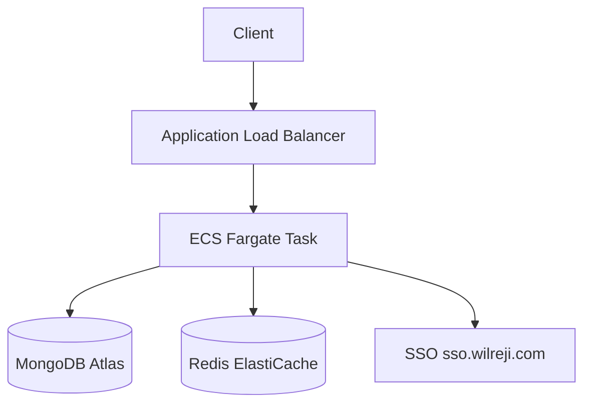

# Architecture — REPLACE-ME

> Replace this template with the actual architecture for your service.
> Required sections per willdesign-rules/development/per-repo-doc-standard.md §3.

## Overview

One paragraph: what this service does, who uses it, what problem it solves.

## Component Map

## Data Flow

Primary request path:
1. Client sends request to `https://<service>.<env>.wilreji.com`.
2. CloudFront / ALB routes to ECS Fargate task.
3. Task validates JWT with SSO (`@willdesigntech/sso-client`).
4. Task reads/writes MongoDB Atlas.
5. Response returned.

## Dependencies

| Dependency | Type | Why |
|---|---|---|
| MongoDB Atlas | Database | Primary data store |
| Redis (ElastiCache) | Cache | Session / pub-sub |
| SSO (`sso.wilreji.com`) | Auth | JWT validation |

## Infrastructure

Terraform root: `WiLLDesignTech/wilreji-platform/environments/<env>/`
Module library: `platform-ci/terraform-modules` @ `tf-modules-v0.6.0`
State bucket: `willdesigntech-terraform-state` (ap-northeast-1)

## Known Constraints / Tech Debt

- [ ] List anything that will bite a new engineer who doesn't know this service.
